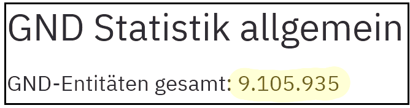
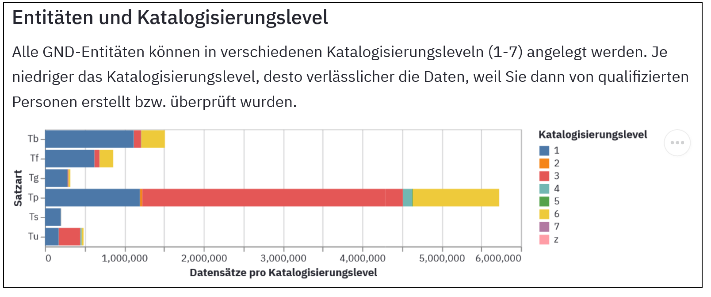
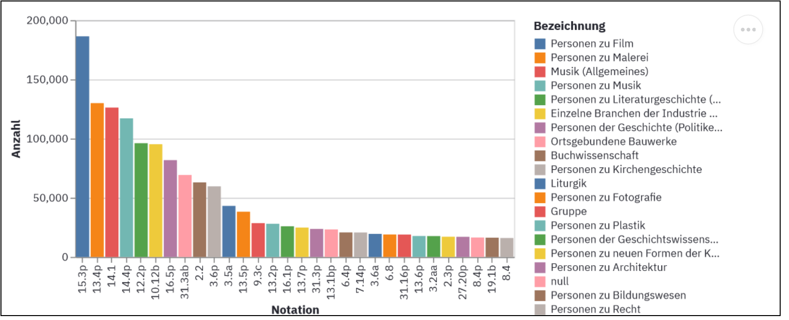
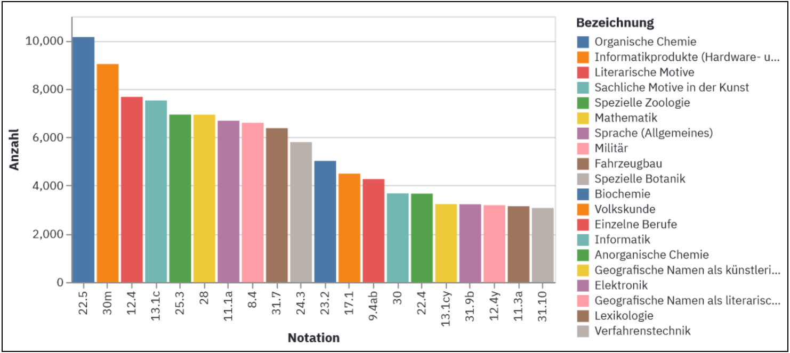

# Bibliotheksdaten {background-image=img/cataloging.jpg}

## Bibliotheksdaten {background-image=img/cataloging.jpg}

- Grundsätzlich nicht anders als andere Daten

- Bibliotheksspezifische **Metadatenformate**\
  (MARC21, MAB2, PICA, ASEQ, METS/MODS, ONIX...)

- Außerhalb von Bibliotheken irrelevant\
  $\Rightarrow$ wenig Support allgemeiner Datenwerkzeuge

- Datenformate altern langsamer als Software

## Neue Anforderungen an Bibliotheksdaten {background-image=img/cataloging.jpg}

- (Linked) Open Data: Verknüpfung mit anderen Daten

- Data Science, Visualisierung, Machine-Learning...

*Wie mit Bibliotheksdaten umgehen?*

# Werkzeuge {background-image=img/tools.jpg}

## Werkzeuge für Bibliotheksdaten {background-image=img/tools.jpg}

1. Allgemeine Datenwerkzeuge (z.B. Excel, OpenRefine)

2. Freie Werkzeuge für bibliothekarische Datenformate

    - Programmierbibliotheken

    - Anwendungsprogramme

3. Interne Werkzeuge (WinIBW, FALCON, BibControl...)

## Allgemeine Datenwerkzeuge {background-image=img/tools.jpg}

*Data Science Werkzeugkasten*

- Interaktive Notebooks (Jupyter, Observable...)

- Kommandozeile (`grep`, `head`, `sort`...)

- OpenRefine

- GitHub/GitLab

- ...

## Freie Werkzeuge für Bibliotheksdaten {background-image=img/tools.jpg}

- Frameworks
  - [Catmandu](https://librecat.org/)
  - [Metafacture](https://metafacture.org/)

- Werkzeuge für PICA-Daten
  - [pica-rs](https://deutsche-nationalbibliothek.github.io/pica-rs/)
  - [picadata](https://metacpan.org/pod/picadata)

- Weitere: 
  [MABLE+/Marcel](https://www.kobv.de/entwicklung/software/),
  [QA Catalogue](https://pkiraly.github.io/)...

# Beispiele

## Arbeiten auf der Kommandozeile

- Programme auf der Kommandozeile folgen im Allgemeinen dem EVA-Prinzip

{width=80% margin=auto}

## Verkettung von Programmen durch Pipes

- Programme können durch Pipes "|" miteinander verkettet werden

{width=70% margin=auto}

```bash
$ cat FILE | head -5 | shuf
```

## Vorteile

- Integration in Data Science Workflows\
  (Skripte, Makefiles, Cron-Jobs, Versionskontrolle)

- Es stehen eine große Anzahl an Standardwerkzeugen zur Verfügung (`head`, `grep`)

- Umfangreiches Literatur- und Fortbildungsangebot

## Zählen von PICA-Datensätzen

```bash
$ wc -l DUMP.dat
1000

$ picadata -f plus DUMP.dat
1000 records
36111 fields

$ pica count DUMP.dat
1000 records
36111 fields
83814 subfields
```

## Filtern von PICA-Datensätzen

```bash
$ pica filter -s \
    "002@.0 =^ 'Tp' && 028A.a == 'Goethe'" \
    | pica count --records
14

$ pica filter -s "002@.0 =^ 'Tp' && 028A.a == 'Goethe'" \
    | picadata -2 -f plain -t json "028A"
[["028A","","d","Friedrich","a","Goethe"]]
[["028A","","d","August","c","von","a","Goethe"]]
```
## Tabellieren von Daten

```bash
$ pica filter -s
    "002@.0 =^ 'Tp' && 028A.a == 'Goethe'" GND.dat \
    | pica select "003@.0, 028A{a, d}"
117749346,Goethe,Friedrich
11854022X,Goethe,August
118540246,Goethe,Katharina Elisabeth
118628011,Goethe,Christiane
...
```

## Häufigkeitsverteilung eines Unterfelds

```bash
$ pica filter -s "002@.0 =^ 'Tg'" GND.dat \
    | pica frequency -l 3 -H "code,count" "042B.a"
code,count
XA-IT,30149
XA-DE-BY,26694
XA-FR,17452
```

## Abfrage per SRU-API

```bash
$ catmandu convert SRU \
    --base http://sru.k10plus.de/opac-de-627 \
    --recordSchema picaxml \
    --parser picaxml \
    --query pica.sgd=590 \
    to PICA --type plain
```

## Zwischenfazit

- Werkzeuge lassen sich miteinander kombinieren\
    $\Rightarrow$ Stärken der verschiedenen Tools ergänzen sich
- Erzeugen von Standardformaten (CSV, JSON)\
    $\Rightarrow$ Programmiersprachen und -bibliotheken nutzen\
    $\Rightarrow$ Nutzen von allgemeinen Datenwerkzeuge

## Demo: GND-Dashboard

- Statistische Auswertungen (Datenbasis PICA+)
- Selektion und Transformation der Daten mit _pica-rs_
- Datenaufbereitung und Visualisierung mit Python

## Filtern des Gesamtabzugs

- Gesamtabzug der DNB ist ca. 44GB groß\
    $\Rightarrow$ Titeldaten (`title.dat`): 38GB\
    $\Rightarrow$ Normdaten (`gnd.dat`): 5.5GB

```bash
$ pica filter -s "002@.0 =^ 'T' && !008@.a?" DUMP.dat \
    -o gnd.dat

$ pica filter -s --invert-match "002@.0 =^ 'T'" DUMP.dat \
    -o title.dat
```

## GND-Entitäten gesamt

{width=70% margin=right}

```bash
$ pica count --records gnd.dat
9.105.935
```


## Entitäten und Katalogisierungslevel

{width=70% margin=right}

```bash
$ pica frequency --limit 3 "002@.0" gnd.dat
Tp3,3288170
Tp1,1197189
Tb1,1116481
```

## GND-Systematik

{width=70% margin=right}

```bash
$ pica frequency --limit 3 "042A.a" gnd.dat
15.3p,186402
13.4p,129972
14.1,126224
```

## GND-Systematik (nur Ts)

{width=70% margin=right}

```bash
$ pica filter "002@.0 =^ 'Ts'" gnd.dat \
    | pica frequency "042A.a"
22.5,10146
30m,9029
12.4,7671
```

# Ausblick {background-image=img/ephesus-library.jpg}

## Interoperabilität und Standards {background-image=img/ephesus-library.jpg}

- Werkzeuge sollten sich kombinieren lassen

- Gemeinsame Sprachen (PICA Path, Fix, Avram...)

- Standardformate

## Herausforderungen {background-image=img/ephesus-library.jpg}

- Dokumentation, Fortbildung, Einarbeitung

- Softwareentwicklung ist Daueraufgabe

- Entwicklung hängt oft an einzelnen Personen\
  (Beispiel: MarcEdit, zumal nur Freeware)

- Projektgetriebene Entwicklung selten nachhaltig\
  (Beispiel: d:swarm)

## Weiterführende Resourcen {background-image=img/ephesus-library.jpg}

- Dokumentation der jeweiligen Programme

- [Einführung in die Verarbeitung von PICA-Daten](https://pro4bib.github.io/pica/)

- [Processing MARC with open source tools](https://github.com/jorol/processing-marc)

- [Handbuch IT in Bibliotheken](https://it-in-bibliotheken.de) (geplant)

- Magnus Pfeffer (2016): Open Source Software zur Verarbeitung und Analyse von Metadaten.
  Präsentation auf dem 6. Bibliothekskongress. [urn:nbn:de:0290-opus4-24490](http://nbn-resolving.de/urn/resolver.pl?urn:nbn:de:0290-opus4-24490)

## Bildquellen

Von Wikimedia Commons

- [New York Public Library 1923](https://commons.wikimedia.org/wiki/File:Room_100,_including_card_catalogs_(3110117236).jpg)

- [Werkzeuge: CC-BY-SA 4.0 Franz van Duns](https://commons.wikimedia.org/wiki/File:DIY_means_choosing_the_right_tool_for_the_purpose_-_a_watchmaker%27s_nightmare.jpg)

- [Epesus Celsus Library CC-BY-SA 3.0 Benh LIEU SONG](https://commons.wikimedia.org/wiki/File:Ephesus_Celsus_Library_Fa%C3%A7ade.jpg)

## Guter Rat zum Schluss {background-image=img/tools.jpg}

* Datenverarbeitung ist keine Wissenschaft sondern Handwerk!

* Übung macht die Meister*in!

