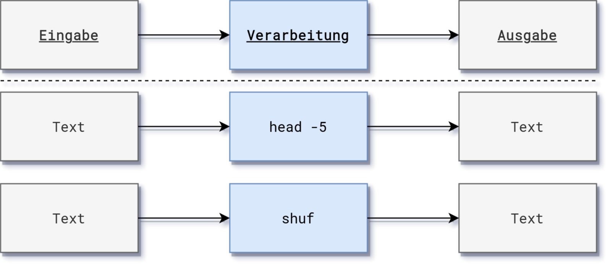

# Bibliotheksdaten {background-image=cataloging.jpg}

## Bibliotheksdaten {background-image=cataloging.jpg}

- *Grundsätzlich* nicht anders als andere Daten

- Aber oft Bibliotheksspezifische Metadatenformate\
  (MARC21, MAB2, PICA, ASEQ, METS/MODS, ONIX...)

- Außerhalb von Bibliotheken irrelevant\
  $\Rightarrow$ wenig Support allgemeiner Datenwerkzeuge

- Datenformate altern viel langsamer als Software

## Neue Anforderungen an Bibliotheksdaten {background-image=cataloging.jpg}

- Öffnung und Verknüpfung mit anderen Datenbeständen

- Data Science, Big Data, Visualisierung, Machine-Learning...

*Wie mit Bibliotheksdaten umgehen?*

# Werkzeuge {background-image=tools.jpg}

## Werkzeuge für Bibliotheksdaten {background-image=tools.jpg}

1. Allgemeine Datenwerkzeuge (z.B. Excel, OpenRefine)

2. Freie Werkzeuge für bibliothekarische Datenformate

    - Programmierbibliotheken

    - Anwendungsprogramme

3. Integrierte/Interne Werkzeuge (WinIBW, FALCON, BibControl...)

## Allgemeine Datenwerkzeuge {background-image=tools.jpg}

*Data Science Werkzeugkasten*

- Interaktive Notebooks (Jupyter, Observable...)

- Kommandozeile (`grep`, `head`, `sort`...)

- OpenRefine

- GitHub/GitLab

- ...

## Freie Werkzeuge für Bibliotheksdaten {background-image=tools.jpg}

- [Catmandu](https://librecat.org/)

- [Metafacture](https://metafacture.org/)

- [pica-rs](https://deutsche-nationalbibliothek.github.io/pica-rs/) / [picadata](https://metacpan.org/pod/picadata)

- [MABLE+/Marcel](https://www.kobv.de/entwicklung/software/)

- [QA Catalogue](https://pkiraly.github.io/), [Cocoda](https://coli-conc.gbv.de/cocoda/)...

# Anwendungsbeispiele

## Arbeiten auf der Kommandozeile

- Programme auf der Kommandozeile folgen im Allgemeinen dem EVA-Prinzip

{width=80% margin=auto}

## Verkettung von Programmen durch Pipes

- Programme können durch "Pipes" miteinander verkettet werden, wenn die jeweilige Eingabe mit der Ausgabe übereinstimmt
- Beispiel: Ausgabe der ersten 5 Zeilen in zufälliger Reihenfolge

{width=80% margin=auto}

```bash
$ cat FILE | head -5 | shuf
```

## Vorteile

- Integration in Data Science Workflows (Shell-Skripte, Makefiles, Cron-Jobs, DVC)
- Es stehen eine große Anzahl an Standardwerkzeugen zur Verfügung (`head`, `grep`)
- Kein bibliothekarisches Spezialwissen nötig

## Beispiel: Zählen von PICA-Datensätzen

```bash
$ wc -l DUMP.dat

1000

$ picadata -f plus DUMP.dat

1000 records
36111 fields

$ pica count DUMP.dat

1000 records
36111 fields
83814 subfields
```

## Beispiel: Filtern von PICA-Datensätzen

```bash
$ pica filter -s \
    "002@.0 =^ 'Tp' && 028A.a == 'Goethe'" \
    | pica count --records

14

$ pica filter -s "002@.0 =^ 'Tp' && 028A.a == 'Goethe'" \
    | picadata -2 -f plain -t json "003@|028A"

[["028A","","d","Friedrich","a","Goethe"]]
[["028A","","d","August","c","von","a","Goethe"]]
```
## Beispiel: Tabellieren von Daten

```bash
$ pica filter -s
    "002@.0 =^ 'Tp' && 028A.a == 'Goethe'" GND.dat \
    | pica select "003@.0, 028A{a, d}"

117749346,Goethe,Friedrich
11854022X,Goethe,August
118540246,Goethe,Katharina Elisabeth
118628011,Goethe,Christiane
...
```

## Beispiel: Häufigkeitsverteilung eines Unterfelds

```bash
$ pica filter -s "002@.0 =^ 'Tg'" GND.dat \
    | pica frequency -l 3 -H "code,count" "042B.a"

code,count
XA-IT,30149
XA-DE-BY,26694
XA-FR,17452
```

## Beispiel: Abfrage per SRU-API

```bash
$ catmandu convert SRU --base http://sru.k10plus.de/opac-de-627 \
    --recordSchema picaxml --parser picaxml --query pica.sgd=590 \
    to PICA --type plain
```

## GND-Dashboard..

TBD

# Ausblick

## Interoperabilität und Standards

- Werkzeuge sollten sich gut mit anderen kombinieren lassen

- Einigung auf gemeinsame Standards (Avram, PICA Path, Fix...)

## Herausforderungen

- Dokumentation, Fortbildung, Einarbeitung

- Softwareentwicklung ist Daueraufgabe

- Entwicklung hängt oft an einzelnen Personen\
  (Beispiel: MarcEdit, zumal nur Freeware)

- Projektgetriebene Entwicklung selten nachhaltig\
  (Beispiel: d:swarm)

## Weiterführende Resourcen

* Dokumentation der jeweiligen Programme

* [Einführung in die Verarbeitung von PICA-Daten](https://pro4bib.github.io/pica/)

* [Processing MARC with open source tools](https://github.com/jorol/processing-marc)

* [it-in-bibliotheken]<https://it-in-bibliotheken.de> (geplant)

* Magnus Pfeffer (2016): Open Source Software zur Verarbeitung und Analyse von Metadaten.
  Präsentation auf dem 6. Bibliothekskongress. [urn:nbn:de:0290-opus4-24490](http://nbn-resolving.de/urn/resolver.pl?urn:nbn:de:0290-opus4-24490)

## Guter Rat zum Schluss

Datenverarbeitung ist keine Wissenschaft sondern Handwerk!

Übung macht die Meister*in!

